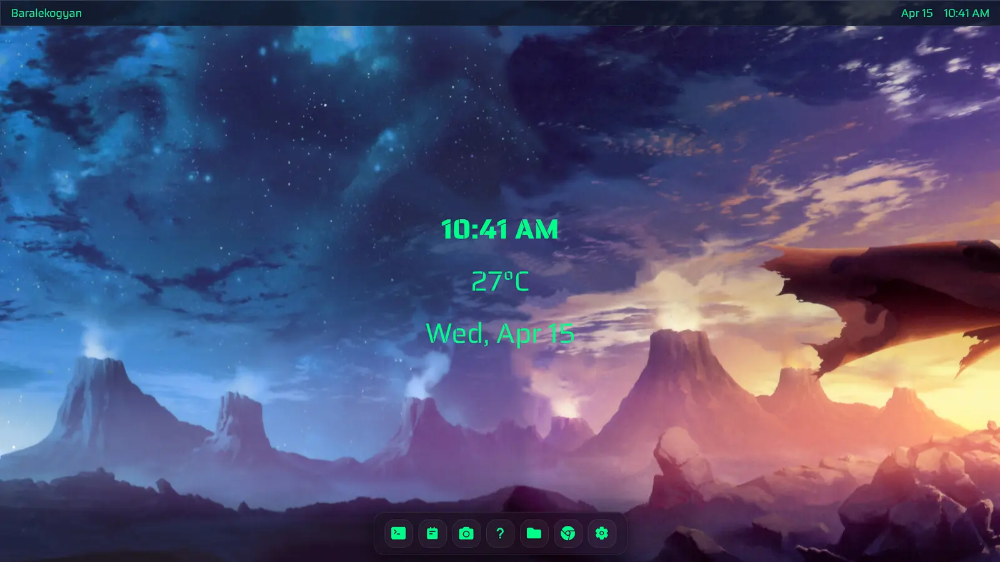

# Suprland\*

A **tiling-based** Web Operating system live at [Suprland\*](https://onkokain.github.io/webOS/)


---

## Overview

Suprland* is a **tiling based** web-OS that you can access directly through your browser. It is currently live at [Suprland*](https://onkokain.github.io/webOS/) and can be accessed from any web browser with HTML5 and modern JS support. I wanted to build a web OS that would differentiate itself from the rest; and what I came up with was Suprland\*, not a floating based **BUT** a tiling-based Web-OS.

You might ask what _tiling-based_ means. In simple terms, the windows are like tiles of a wall, they arrange and resize themselves perfectly and never overlap. You can have up to 6 windows open at a time and toggle through them at insane speed with keyboard shortcuts. This leads to a boost in overall efficiency and performance.

---

## Features

- Tiling Window manager
- Primarily Keyboard Based Navigation
- Working Applications
- Persistent User Sessions
- Working Desktop Environment
- File Support for image/videos/audio/text
- Fully fledged Taskbar and TopBar
- Full Personalization Features
- Pannable Wallpapers (Panorama)
- Animations and features
- CLI with custom commands

---

## Installation

The demo is currently live at [Suprland](https://onkokain.github.io/webOS/)
You can also locally clone the repo with:

```bash
git clone https://github.com/Onkokain/webOS.git
```

---

## Usage

After cloning the repo:

```bash
cd webOS
npm install
npm run dev
```

Then open your browser at:

```bash
http://localhost:5173
```

---

## Controls and Navigation

### Basic Navigation

- Use keyboard shortcuts to navigate between windows
- Focus switches instantly between tiles
- Keyboard shortcuts are highly recommned but mouse works as well

---

### Window Management

- All windows are tiling-based
- Opening a new window from taskbar and/or commands automatically splits the working space into tiles
- Closing a window immediately causes the other active tabs to occupy the available space

---

## Keyboard Shortcuts

### Desktop

```text
Middle Click Drag  : Move wallpaper
Ctrl + Left Click  : Move widget
Right Click        : Create new files/folders
F2                 : Rename selected file/folder
Ctrl + C           : Copy
Ctrl + X           : Cut
Ctrl + V           : Paste
Delete             : Delete selected
Shift + Click      : Multi-select
Double Click       : Open file/folder
```

---

### Windows

```text
Ctrl + Enter       : Open terminal
Ctrl + N           : Open notepad
Ctrl + C           : Open camera
Ctrl + H           : Open help
Ctrl + F           : Open file manager
Ctrl + B           : Open browser
Ctrl + S           : Open settings
Ctrl + D           : Close focused window
Middle Click       : Close window (title bar)
Ctrl + Arrow Keys  : Change focused window
```

---

### Terminal Commands

```text
help               : Show all commands
echo <text>        : Print text
date               : Show date and time
whoami             : Current user
hostname           : System hostname
uname              : System info
uptime             : Session uptime
pwd                : Current directory
cd <dir>           : Change directory
ls [dir]           : List files
mkdir <dir>        : Create directory
touch <file>       : Create file
cat <file>         : Read file
rm <path>          : Delete file/folder
history            : Command history
cal                : Calendar
env                : Environment variables
color <color>      : Change text color
browser <url>      : Open URL
hackertype         : Fun typing mode
heaven             : Easter egg
clear / cls        : Clear terminal
keybinds           : Edit keybinds
```

---

### Notepad

```text
Ctrl + S           : Save note to desktop
```

---

### Camera

```text
photo              : Take photo
video              : Record video
audio              : Record audio
[save]             : Save capture
[discard]          : Discard capture
```

---

### File Manager

```text
Single Click       : Select file/folder
Double Click       : Open file/folder
Ctrl + Click       : Toggle selection
Shift + Click      : Select range
Delete             : Delete selected
Ctrl + C           : Copy
Ctrl + X           : Cut
Ctrl + V           : Paste
Right Click        : Context menu
```

---

### Settings

```text
Wallpaper          : Change wallpaper
Taskbar            : Configure position
Personalize        : Customize UI
System             : Reset user data
```

---

## FAQ

0. Naming
   Suprland\* includes an asterisk representing limitless ambition within limitations.

1. What is it?
   A tiling Web OS running entirely in the browser.

2. Apps
   Use taskbar or keybinds.

3. Windows
   Maximum 6 for usability balance.

4. Files
   Stored in localStorage.

5. Customization
   Wallpapers + themes available.

6. Data
   Frontend only. No external storage.

7. Mobile
   Not optimized yet.

8. Open Source
   MIT licensed.

9. Author
   Yaman.

10. Contribution
    Mail: korahontoni@gmail.com

11. Limitations
    Browser constraints.

12. Future
    Continuous improvement.

13. Offline
    Works after initial load.

14. Reset
    Terminal or settings.

15. Browser Support
    Most modern browsers supported.

---

## Final Note

Suprland\* is not trying to replace native operating systems. It's built to test the capabilities of the web and how far I can take a web based operating system.
Also, if it exists it MUST run doom..

---
